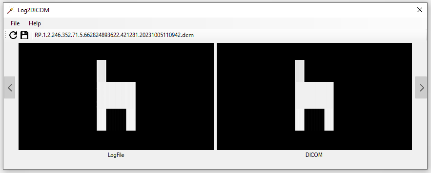

# Log2DICOM: A python-based tool for Modifying original DICOM planning files based on measured treatment data                                  

This script extracts relevant information from log files and uses that data to make appropriate modifications to DICOM files. Designed with precision and user-friendliness in mind, it streamlines the process of adjusting medical imaging data based on logged operations or events.

Author: Ezequiel Agustin Cabrera Lacey                                  
Date: 9-13-2023                                                        
Version: DEMO                                                       

# Demo usage:
This stand-alone executable performs the core caracteristic of the main project, apply the recorded Logfile positions over the according control point instance in the original plan.

The usage is simple:
1. Import the DICOM RT plan.
2. Import either the corresponding Trajectorylog file/s, or only the A file/s for the Dynalogfile/s.
3. Export the modified plan to the selected folder. The `.dcm` file is named `{PATIENT ID}_mod.cdm`

The integration of this software could be done by a more complex GUI to make visual reconstructions, data analysis and more.

# Recognitions:                                                           
-National University of Córdoba an Zunino Institute to provide the knowledge and space to make this project posible.                      
-Dr. Miguel Chesta and Dr. Daniel Venencia for their contributions, insights, and support during the development of this scritp.           

# DISCLAIMER:
The capabilities of this project was tested only with Varian Logfiles produce by the Truebeam STx (Trajectorylog) and Novalis TX (Dynalogfile) both equipted with a Varian HD120 MLC, any extent of this procedure remains unknown and untested, any consequence of its application fall exclusively under the user.
This software constitude the final project of a physics degree and is provided "as is", without warranty of any kind, express or implied, including but not limited to the warranties of merchantability, fitness 
for a particular purpose, and non-infringement.                         
In no event shall the authors or copyright holders be liable for any claim, damages or other liability, whether in an action of contract, tort or otherwise, arising from, out of or in connection with the software or the use or other dealings in the software. Users are encouraged to test the software extensively before relying on it for critical applications.                          
